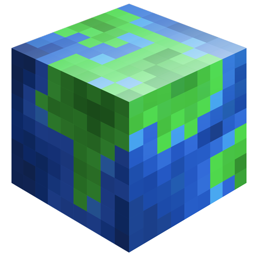
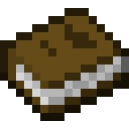
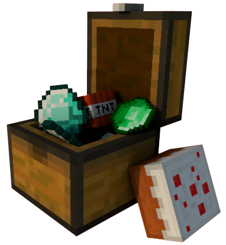
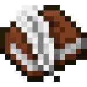

# 2024.1-Minecraft

<div align="center">
    
    <p>Figura 1: Mundo do Minecraft</p>
</div>

#  Contribuidores

Nossa equipe é composta pelos estudantes de Engenharia de Software da Universidade de Brasília, conforme listado abaixo.

<table align="center">
  <tr>
    <td align="center">
      <a href="https://github.com/trindadea">
        
      </a>
      <br>
      <span style="font-size: 20px; font-weight: 400">Arthur Carneiro Trindade</span>
      <p>180098080</p>
    </td>
    <td align="center">
      <a href="https://github.com/EhOBruno">
        
      </a>
      <br>
      <span style="font-size: 20px; font-weight: 400">Bruno Ricardo de Menezes</span>
      <p>221007680</p>
    </td>
    <td align="center">
      <a href="https://github.com/EhOMiguel">
        
      </a>
      <br>
      <span style="font-size: 20px; font-weight: 400">Miguel Moreira da Silva de Oliveira</span>
      <p>202023968</p>
    </td>
  </tr>
</table>

#  Sobre o Projeto

Este repositório é dedicado ao desenvolvimento de um jogo inspirado no Minecraft, onde a missão é recriar o jogo em um Multi-User Dungeon (MUD). Este projeto é uma atividade da disciplina Sistemas de Banco de Dados 1 da Universidade de Brasília (UnB), no semestre 2024.1. O objetivo é aplicar conceitos de banco de dados no desenvolvimento de um MUD, documentando todo o processo.

#  História do Jogo

No mundo de Minecraft, o jogador inicia sua jornada em um ambiente vasto e gerado aleatoriamente, repleto de biomas diversos como florestas, montanhas, desertos e oceanos. A principal missão é sobreviver, coletando recursos naturais como madeira, pedra e metais para criar ferramentas, construir abrigos e enfrentar monstros que surgem à noite.

Conforme o jogador avança, ele pode explorar cavernas e minas em busca de materiais raros, criar equipamentos mais avançados e até construir estruturas complexas. A viagem também leva o jogador a outros reinos, como o Nether, um mundo infernal cheio de perigos e tesouros.

A jornada culmina na busca pelo Ender Dragon, o chefe final do jogo, localizado em uma dimensão chamada The End. Para chegar lá, o jogador precisa encontrar e ativar um portal escondido em uma fortaleza subterrânea. A batalha contra o Ender Dragon é intensa e requer preparação meticulosa, mas derrotá-lo marca a conclusão épica da aventura, embora o jogo continue oferecendo inúmeras possibilidades de exploração e construção.


#  Entregas

- Módulo 1
    - <a href="https://sbd1.github.io/2024.1-Minecraft/modulo_1/der/" target="_blank">Diagrama Entidade-Relacionamento</a>
    - <a href="https://sbd1.github.io/2024.1-Minecraft/modulo_1/modeloRelacional/" target="_blank">Modelo Relacional</a>
    - <a href="https://sbd1.github.io/2024.1-Minecraft/modulo_1/dicDados/" target="_blank">Dicionário de Dados</a>
    - <a href="https://www.youtube.com/watch?v=a7Gq16dQrgY" target="_blank">Apresentação do Módulo 1</a>
- Módulo 2
    - <a href="https://sbd1.github.io/2024.1-Minecraft/modulo_2/algebra_relacional/" target="_blank">Álgebra Relacional</a>
    - <a href="https://sbd1.github.io/2024.1-Minecraft/modulo_2/ddl/" target="_blank">DDL (Data Definition Language)</a>
    - <a href="https://sbd1.github.io/2024.1-Minecraft/modulo_2/dml/" target="_blank">DML (Data Manipulation Language)</a>
    - <a href="https://sbd1.github.io/2024.1-Minecraft/modulo_2/dql/">DQL (Data Query Language)</a>
    - <a href="" target="_blank">Apresentação do Módulo 2</a>
 
#  Como Rodar o Jogo


### 1. Instale o Docker

Primeiro, é necessário instalar o Docker(27.0.3). Você pode fazer isso acessando o seguinte link: [Instalar Docker](https://www.docker.com/get-started).

### 2. Clone o Repositório

Após instalar o Docker, clone o repositório do jogo usando o comando abaixo:

```bash
git clone https://github.com/SBD1/2024.1-Minecraft.git
```

### 3. Acesse o Diretório do Jogo

Depois de clonar o repositório, entre no diretório do jogo com o seguinte comando:

```bash
cd 2024.1-Minecraft
```

### 4. Acesse o Diretório Docker

Agora que você está dentro da pasta do jogo, é necessário acessar a pasta do Docker:

```bash
cd Docker
```

### 5. Suba o Container Docker
Dentro da pasta Docker, suba e entre no container com os comandos:

```bash
docker-compose up -d --build
docker exec -it python_app bash
```
O Docker é uma ferramenta poderosa porque garante que o jogo rodará em um ambiente consistente, evitando problemas de versões ou dependências.

### 6. Rode o Jogo

Com todas as dependências instaladas no container, rode o jogo usando:

```bash
python main.py
```

### 7. Finalize o Jogo

Quando terminar de jogar, finalize o jogo pressionando Ctrl + C.

### 8. Saia do Container

Saia do container do Docker digitando:

```bash
exit
```

### 9. Encerre o Container

Por fim, não se esqueça de encerrar o container do Docker com:

```bash
docker-compose down
```

### Tenha uma ótima diversão!

<!-- #  História do Jogo

[Incluir uma breve sinopse da história do jogo aqui]

#  Apresentação

[Incluir o link para download do vídeo da apresentação] -->

##  Histórico de Versões

| Versão | Data       | Descrição                                      | Autor                                               | Revisão                                               |
| :----: | :--------: | ---------------------------------------------- | --------------------------------------------------- | ----------------------------------------------------- |
| `1.0`  | 14/04/2024 | Criação inicial do README e estrutura básica   | [Arthur Carneiro Trindade](https://github.com/trindadea) | [Bruno Ricardo de Menezes](https://github.com/EhOBruno) |
| `1.1`  | 14/04/2024 | Acrescentando contribuidores | [Bruno Ricardo de Menezes](https://github.com/EhOBruno) | [Miguel Moreira da Silva de Oliveira](https://github.com/EhOMiguel) |
| `1.2`  | 12/07/2024 | Inclusão das informações sobre o jogo    | [Miguel Moreira da Silva de Oliveira](https://github.com/EhOMiguel) | [Arthur Carneiro Trindade](https://github.com/trindadea) |
| `1.2`  | 12/07/2024 | Ajuste da página Início    | [Arthur Carneiro Trindade](https://github.com/trindadea) | [Bruno Ricardo de Menezes](https://github.com/EhOBruno)<br>[Miguel Moreira da Silva de Oliveira](https://github.com/EhOMiguel) |
| `2.0`  | 12/07/2024 | Inclusão das informações de como rodar o jogo    | [Miguel Moreira da Silva de Oliveira](https://github.com/EhOMiguel) | [Arthur Carneiro Trindade](https://github.com/trindadea) |
