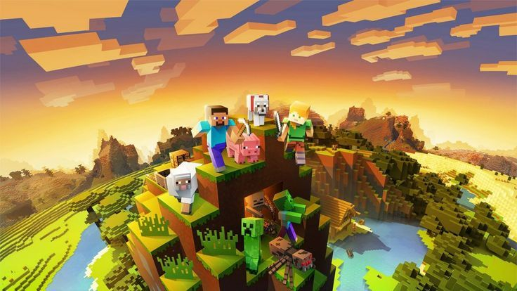
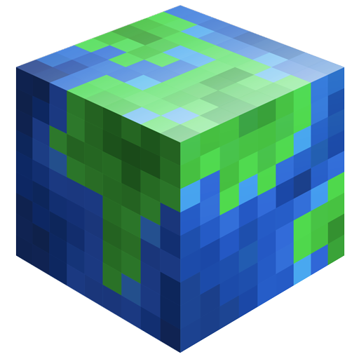
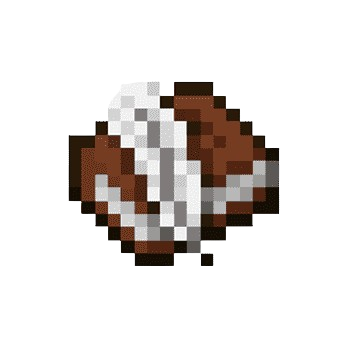

# 2024.1-Minecraft

    
    
Figura 1: Mundo do Minecraft

#  Contribuidores

Nossa equipe é composta pelos estudantes de Engenharia de Software da Universidade de Brasília, conforme listado abaixo.

<table align="center">
  <tr>
    <td align="center">
      
       
      Arthur Carneiro Trindade
      
180098080

    </td>
    <td align="center">
      
       
      Bruno Ricardo de Menezes
      
221007680

    </td>
    <td align="center">
      
       
      Miguel Moreira da Silva de Oliveira
      
202023968

    </td>
  </tr>
</table>

#  Sobre o Projeto

Este repositório é dedicado ao desenvolvimento de um jogo inspirado no Minecraft, onde a missão é recriar o jogo em um Multi-User Dungeon (MUD). Este projeto é uma atividade da disciplina Sistemas de Banco de Dados 1 da Universidade de Brasília (UnB), no semestre 2024.1. O objetivo é aplicar conceitos de banco de dados no desenvolvimento de um MUD, documentando todo o processo.

#  História do Jogo

No mundo de Minecraft, o jogador inicia sua jornada em um ambiente vasto e gerado aleatoriamente, repleto de biomas diversos como florestas, montanhas, desertos e oceanos. A principal missão é sobreviver, coletando recursos naturais como madeira, pedra e metais para criar ferramentas, construir abrigos e enfrentar monstros que surgem à noite.

Conforme o jogador avança, ele pode explorar cavernas e minas em busca de materiais raros, criar equipamentos mais avançados e até construir estruturas complexas. A viagem também leva o jogador a outros reinos, como o Nether, um mundo infernal cheio de perigos e tesouros.

A jornada culmina na busca pelo Ender Dragon, o chefe final do jogo, localizado em uma dimensão chamada The End. Para chegar lá, o jogador precisa encontrar e ativar um portal escondido em uma fortaleza subterrânea. A batalha contra o Ender Dragon é intensa e requer preparação meticulosa, mas derrotá-lo marca a conclusão épica da aventura, embora o jogo continue oferecendo inúmeras possibilidades de exploração e construção.

#  Entregas

- [Módulo 1]
    - [Diagrama Entidade-Relacionamento](./gitpages/docs/modulo_1/der.md)
    - [Modelo Relacional](./docs/Entrega-01/Modelo_Relacional.md)
    - [Dicionário de Dados](./gitpages/docs/modulo_1/modeloRelacional.md)
 
<!-- #  Como Rodar o Jogo

[Incluir instruções sobre como rodar o jogo]

#  História do Jogo

[Incluir uma breve sinopse da história do jogo aqui]

#  Apresentação

[Incluir o link para download do vídeo da apresentação] -->

##  Histórico de Versões

| Versão | Data       | Descrição                                      | Autor                                               | Revisão                                               |
| :----: | :--------: | ---------------------------------------------- | --------------------------------------------------- | ----------------------------------------------------- |
| `1.0`  | 14/04/2024 | Criação inicial do README e estrutura básica   | [Arthur Carneiro Trindade](https://github.com/trindadea) | [Bruno Ricardo de Menezes](https://github.com/EhOBruno) |
| `1.1`  | 14/04/2024 | Acrescentando contribuidores | [Bruno Ricardo de Menezes](https://github.com/EhOBruno) | [Miguel Moreira da Silva de Oliveira](https://github.com/EhOMiguel) |
| `1.2`  | 12/07/2024 | Inclusão das informações sobre o jogo    | [Miguel Moreira da Silva de Oliveira](https://github.com/EhOMiguel) | [Arthur Carneiro Trindade](https://github.com/trindadea) |

