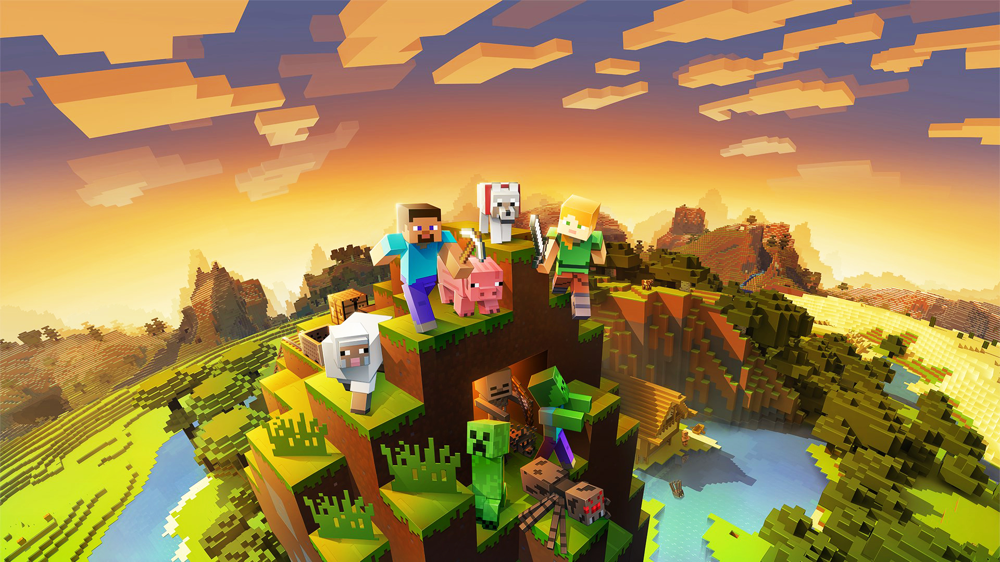

# 2024.1 - Minecraft

    

Este repositório contém a recriação do jogo Minecraft no estilo MUD (Multi-User Dungeon), desenvolvida como parte da disciplina de Sistemas de Bancos de Dados 1, na Universidade de Brasília. 

## Equipe

<table align="center">
  <tr>
    <td align="center">
      
       
      Arthur Carneiro Trindade
      
180098080

    </td>
    <td align="center">
      
       
      Bruno Ricardo de Menezes
      
221007680

    </td>
    <td align="center">
      
       
      Miguel Moreira da Silva de Oliveira
      
202023968

    </td>
  </tr>
</table>

### Jogo

No mundo de Minecraft, o jogador inicia sua jornada em um ambiente vasto e gerado aleatoriamente, repleto de biomas diversos como florestas, montanhas, desertos e oceanos. A principal missão é sobreviver, coletando recursos naturais como madeira, pedra e metais para criar ferramentas, construir abrigos e enfrentar monstros que surgem à noite.

Conforme o jogador avança, ele pode explorar cavernas e minas em busca de materiais raros, criar equipamentos mais avançados e até construir estruturas complexas. A viagem também leva o jogador a outros reinos, como o Nether, um mundo infernal cheio de perigos e tesouros.

A jornada culmina na busca pelo Ender Dragon, o chefe final do jogo, localizado em uma dimensão chamada The End. Para chegar lá, o jogador precisa encontrar e ativar um portal escondido em uma fortaleza subterrânea. A batalha contra o Ender Dragon é intensa e requer preparação meticulosa, mas derrotá-lo marca a conclusão épica da aventura, embora o jogo continue oferecendo inúmeras possibilidades de exploração e construção.
